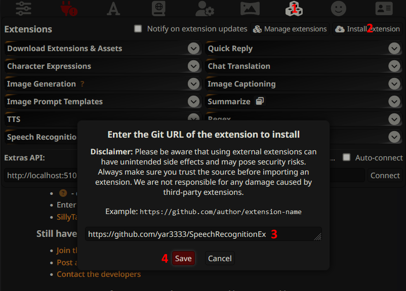

# SpeechRecognitionEx 

Speech recognition plugin for [SillyTavern](https://sillytavernai.com/).
Based on original official plugin [Extension-Speech-Recognition](https://github.com/SillyTavern/Extension-Speech-Recognition).

Major changes compared to original extension:

  * high-quality voice activity detector
  * speech end detection: waiting one second more to detect that the user is still speaking
  * commands support also cyrillic languages
  * under the hood: code refactoring to use Vue 3 + Typescript
  * bugfixes

## Installation

`https://github.com/yar3333/SpeechRecognitionEx`

## License and credits

GPLv3

ricky0123's VAD / https://github.com/ricky0123/vad
